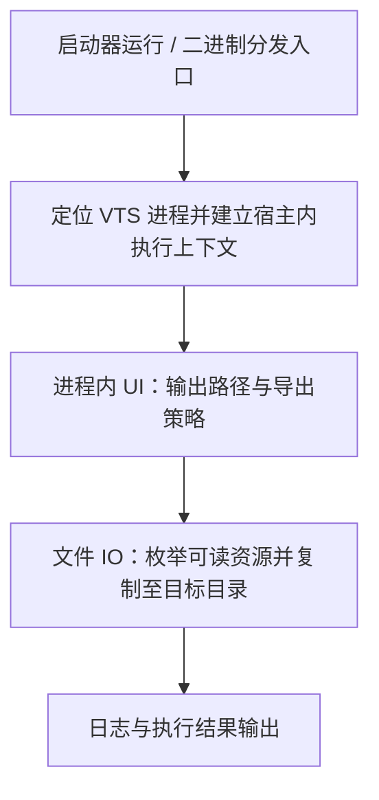

# Dokan 虚拟卷 + PID 过滤方案：公开说明、漏洞披露与 VTSResourceHook 发布动机

## 一、事情是怎么开始的

### 1.1 最初的缘起与思路

很长一段时间里，我并没打算把下面这套东西写成「对外宣传的技术卖点」。

这套路线最早来自**帮朋友忙**：我与 **「彗星号」** 的老板是朋友，彼此**没有任何利益关系**——我不在彗星号任职、不占股、也不拿分成或顾问费；纯粹是私人交情下，对方在技术上遇到需求，我顺手一起讨论、写一写实现思路。具体需求是：在 Windows 上用一种**不侵入 VTube Studio 官方二进制主体**、又能在业务侧缓解「模型文件散落在普通目录、容易被随手复制」的方式，去承载 Live2D 等资源的访问。

技术选型上需要说明一句：**「用 Dokan 做用户态虚拟卷、在回调里做访问控制」这条整体路线，是我本人想出来的**——面对朋友提出的场景与约束，由我提出采用 [Dokan](https://dokan-dev.github.io/#)，并往下展开：在用户态实现一块**虚拟磁盘**（数据可以只在内存或受控后端），由 Dokan 把系统的打开、读、写、枚举请求转到自定义回调里，再利用 Dokan 文档与社区常提到的能力在回调里做**访问控制**（参见 [Dokan 主页](https://dokan-dev.github.io/#) 对用户态策略与 Access Control 的描述）。后续是在私下交流里与对方讨论细节、并落地实现，并非对方指定必须用 Dokan。

其中一种非常直观、实现成本也低的策略，是记录 **VTube Studio 启动后的进程 PID**，在虚拟卷回调里**仅放行来自该 PID 的 I/O**。从产品话术上，这很容易被包装成：「只有 VTube Studio 能碰这块盘，所以模型被保护了。」

我当时认为有必要在私下交流时把边界讲清楚：它防的是**路径与误操作层面**的暴露，并不是在「本机已存在恶意代码或高权限对手」的前提下仍不可读。朋友之间的技术讨论与具体写法属于私人场合，我没有义务替任何商业话术背书；我与彗星号之间也不存在需要我为其对外宣传背书的合同或利益纽带。

### 1.2 抄袭与话术外溢带来的问题

在我已经完成思路梳理、实现与讨论之后，**出现了他人照搬、抄袭同一套叙事与实现路径的情况**。

这带来两个直接后果：

- **对用户不公平**：若抄袭方继续把「Dokan 虚拟卷 + PID 白名单」描述成难以突破的模型保护，实质是在卖**信息差**——把一个在安全模型上非常脆弱的方案，包装成「技术壁垒」。
- **对当初一起琢磨这件事的朋友一方与我不公平**：**Dokan 路线与工程取舍主要出自我这边**，被外部抄走后却可能反过来挤压我们这类原创讨论的空间，甚至让公众误以为「行业里大家都这么做，所以一定可靠」。

在这种情况下，继续替这套方案的**真实强度**保密，等于间接帮抄袭方维持错觉。我更愿意把话说明白，把边界摊开，让讨论回到**可验证的事实**上。

---

## 二、这条路线「重大漏洞」究竟指什么

### 2.1 PID 不是身份，更不是密钥

在 Windows 上，PID 只是**当前进程表里的一个数字**。它既非密码学凭证，也无法表达「这段代码是否仍由官方/可信模块发起」。

因此，**「只允许 VTube Studio 的 PID 访问虚拟卷」**在严格意义上等价于：

> 我相信**这个进程里跑的所有代码**都是善意的；任何能在这个进程里执行读文件逻辑的一方，我都视为合法用户。

### 2.2 进程内读盘：攻击路径不需要「伪造两个并存 PID」

坊间有时会用「伪造相同 PID」这种不够严谨的说法。更准确、也更具可操作性的描述是：

攻击者**不必**去造一个「和 VTS 相同 PID 的另一个进程」（这在正常系统语义下也不成立），而只需要让读盘行为发生在 **VTube Studio 进程内部**——例如通过注入、被滥用的插件接口、或利用漏洞在进程内执行代码。此时，从 Dokan 用户态 Filter 的视角看，请求来源仍然是**那个被白名单信任的 PID**，虚拟卷内的资源即可被正常打开并读出。

此外还有工程层面的坑：**进程退出后 PID 可能被系统复用**；若策略未与进程对象、映像路径、会话生命周期严格绑定，也可能出现误放行或状态错乱。这些都不改变核心结论：**单靠 PID 过滤，扛不住「同源进程内执行」这一威胁模型。**

### 2.3 与 Dokan 本身的关系

再次强调：[Dokan](https://dokan-dev.github.io/#) 是成熟、合法的用户态文件系统框架，许多正经项目都在用。本文批评的是**「仅靠 PID 白名单就声称模型已安全」**这种**误用与过度承诺**，而不是否定 Dokan 或用户态文件系统这一技术方向。

---

## 三、我为何公开上述漏洞

1. **打破不实营销所需的信息差**  
   把漏洞机制写清楚、讲到可被安全同行与资深用户独立复核的程度，抄袭方就难以继续用「神秘黑盒」吓唬终端用户。

2. **与我当前能力边界对齐**  
   时至今日，我**已经有更好的模型保护方案**——在威胁模型、工程形态上与当年「Dokan + PID」这类权宜之计**不是同一条路线**，且我认为新方案在诚实前提下更值得投入。因此我不再把旧路线当成需要守住的「独家秘密」或技术护城河；公开其硬伤**不会**削弱我现在的方向，反而有助于把讨论从过时叙事上移开。

3. **联系官方：为更好保护 VTS 生态资源，并寻求合作**  
   我已通过**邮件**与 **VTube Studio** 官方**建立联系**。动机不是单纯「报备漏洞」一句话能概括的：我希望在**尊重产品与生态边界**的前提下，推动**对 VTube Studio 相关资源更合理、更可持续的保护**——包括把错误的安全叙事纠偏、把可行的加固方向对齐到官方能接受的形态。**我期待与官方建立合作**（具体合作形式、往来细节与阶段性结论**不在本文展开**）。公开旧路线漏洞与发布验证工具，与上述目标并行：一边让市场不再被 PID 话术误导，一边表明我愿意把后续更好的方案放在**与官方协同**的框架里推进，而不是只在圈外自说自话。

4. **对社区诚实**  
   VTuber 生态里模型资产对作者极其重要；若某种「保护方案」在常见威胁模型下形同虚设，作者有权在**充分知情**的前提下选择是否采购、是否信任某家服务。

---

## 四、我为什么要发布工具 VTSResourceHook

**VTSResourceHook** 是我配套公开论述而发布/维护的**可复现载体**：它向 VTube Studio 进程注入托管模块，在**与 VTS 相同的进程上下文**中枚举并复制 `StreamingAssets` 下的模型与物品等资源（项目内 `ModelCopier` 等处的技术说明即：在进程内读文件，与基于 PID 的放行策略处于同一标识平面）。

我发布它，主要不是为了「炫技」，而是出于下面几类动机：

### 4.1 把「理论漏洞」落实成「任何人都能验证的现象」

安全披露里最怕的是：只写论文式段落，对手反驳「实际做不到」。VTSResourceHook 的存在，等于声明：

> 在典型 Windows 桌面环境下，**不需要**虚构的魔法；只要能在 VTS 进程内执行代码并完成文件 I/O，**基于 PID 的虚拟卷过滤就无法区分**「官方逻辑」与「导出逻辑」。

这样，抄袭方若再声称「我们的 Dokan 方案无法被导出」，就必须面对**可对照的复现路径**，而不是一句口号。

### 4.2 教育作者与购买者：什么承诺不可轻信

许多作者并不熟悉文件系统回调、PID 与进程注入的边界。在**不展开逐步实现教学**的前提下，一个**可运行的验证用二进制**仍能让具备权限的第三方在合规范围内对照现象与本文结论，比纯口头论述更有助于理解：「所谓进程白名单，在桌面安全模型里常常只是**同一进程内的另一段代码**。」

这有助于市场用脚投票：把预算与信任留给**诚实描述威胁模型**的方案，而不是留给复制粘贴的 PID 话术。

### 4.3 与我的公开立场一致：披露漏洞，同时给出验证工具

若只写文档而不提供可验证路径，容易被曲解为「空口污蔑」。发布 VTSResourceHook，是**同一套公开策略的组成部分**：文档讲原理，工具提供**独立第三方**（在安全与合规前提下）可自行验证的手段。二者合在一起，才构成完整的披露与问责语境。

### 4.4 边界说明（请务必阅读）

- VTSResourceHook 具有**明显的滥用风险**。我期望的使用语境是：**安全研究、授权渗透测试、或仅针对本人有权处置的资产**做备份与迁移；对受版权与许可约束的第三方模型，任意导出可能违法或违反服务条款。
- 本工具**不是**对 VTube Studio 官方功能的替代说明，也不代表对官方政策的态度；使用者需自行承担法律与合规责任。
- 公开工具与公开漏洞，是为了**戳破虚假安全宣传**，而不是鼓励在未授权场景下侵犯他人权益。

### 4.5 当前发布形态：仅二进制，不教实现

在**对外分发**上，我**暂时只提供二进制**（例如已构建好的可执行文件），以满足「现象可验证、论述可对质」这一目标；**不打算**在此阶段公开**手把手如何实现**的教程——包括但不限于逐步注入流程、关键调用链拆解、可直接套用的实现草稿等。原理与漏洞层面的讨论，以本文及同类**防御向、披露向**叙述为界；这样做的考虑是：在已经证明「仅靠 PID 的 Dokan 方案不可靠」的前提下，**压低**将同一能力扩散成「人人可抄的作业答案」的面，把精力留给我认为更值得投入的**更好保护方案**与合规沟通。若未来发布策略有变，以届时实际渠道说明为准。

---

## 五、VTSResourceHook 大体实现路线图（仅阶段概览）

以下按**工程阶段**描述工具从「到手」到「完成一次导出」的主干路径，用于让读者理解**整体形态与先后顺序**；**刻意不写**具体技术栈、API、二进制结构、与目标进程的衔接手段、内部目录约定等实现细节——那些内容不在公开教学范围内（与 §4.5 一致）。

### 流程图（示意）

仅标**技术阶段**先后，节点尽量简短；**不涉及**具体 API、注入实现或目录结构（与 §4.5 一致）。

**前置条件**：VTube Studio 进程已运行；否则启动器侧等待或提示，不进入后续阶段。

各阶段在工程上可并行或迭代细化，上图只表示主干的**技术顺序**。

---

## 六、参考链接

- Dokan 用户态文件系统项目主页：<https://dokan-dev.github.io/#>
- **VTSResourceHook**：对外以**二进制分发**为准；若本地或仓库中另有源码、构建脚本或 README，仅供开发者自用或历史留存，**不代表**我会公开教授实现细节（与 §4.5 一致）。

---

*本文为作者个人动机、技术边界与发布策略的说明；其中涉及的安全机制讨论仅供防御、审计与知情决策参考。请勿将本文或相关工具用于未授权访问他人数据或侵犯知识产权的行为。*
