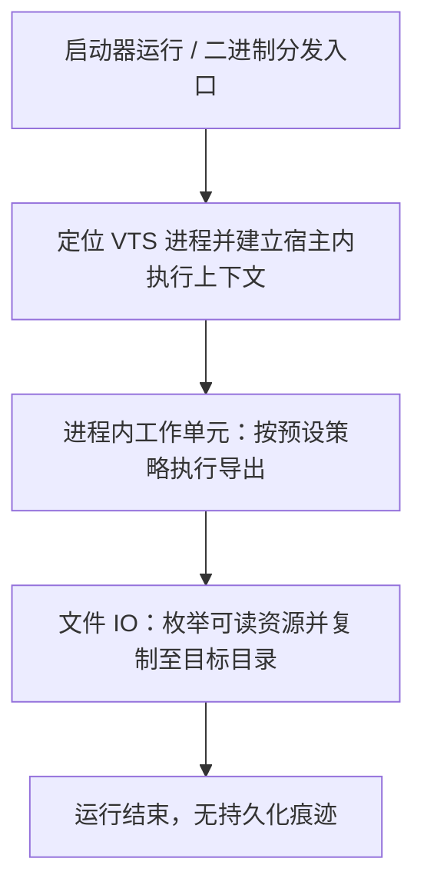

# VTSResourceHook Lite 使用文档

> 一键导出 VTube Studio 已加载模型的工具。单文件、无界面、静默运行。

## 你需要什么

- 一台装有 VTube Studio 的 Windows 电脑
- **VTSResourceHook.Lite.exe**（单个文件，大小约 2 MB）
- 你想导出的模型（以及解锁它所需的任何授权）

## 使用流程

### 步骤 1 —— 启动 VTube Studio

打开 Steam 启动 VTS，或直接双击 `VTube Studio.exe`。

等待 VTS 完全加载：

- 主界面出现
- 左侧的头像/菜单按钮可以正常点击
- 没有任何加载中的转圈

> 没加载完就注入 = 捕获到的内容不完整。

### 步骤 2 —— 通过模型锁打开你要导出的模型

按你平时的方式解锁/打开模型：

- 有授权码就输入授权码
- 有设备锁就用对应设备打开
- 有时间锁就在允许的时间窗口内打开

**必须让模型实际出现在 VTS 屏幕上**，并且：

- 模型正常显示、表情和动作都能响应
- 贴图、物品、配件都已经加载（不是还在读进度条里）
- 如果有延迟加载的物品（比如一些挂件），也要等它们全部出现

> 这一步是整个流程里**最关键**的。模型在屏幕上显示得越完整，后续导出的内容就越完整。

### 步骤 3 —— 以管理员身份运行 VTSResourceHook.Lite.exe

**右键**点击 `VTSResourceHook.Lite.exe` → 选择 **以管理员身份运行**。

程序会：

- 无弹窗
- 无任务栏图标
- 无任何 UI 提示
- 窗口一闪而过（或完全不出现）

**这是正常的，不是失败。** 它正在后台干活。

### 步骤 4 —— 稍等几秒

程序注入 VTS 进程后会在后台自动复制文件。根据模型大小和数量，大约需要：


| 模型规模        | 等待时间        |
| ----------- | ----------- |
| 单个小模型       | 1–3 秒       |
| 多个普通模型      | 5–15 秒      |
| 几十个大模型 + 物品 | 30 秒 – 1 分钟 |


期间 VTS 可以继续正常使用，不会卡顿。

### 步骤 5 —— 等待文件资源管理器自动弹出

复制完成后，**程序会自动打开一个文件资源管理器窗口**，直接定位到这次导出的目录。你不需要手动去找。

这个目录位于 `C:\Users\<你的用户名>\Downloads\` 下，名字是一段 10 个随机字母，例如：

```
Downloads\
├── qpxvnmtklb\       ← 自动弹出的就是这个
├── 其他文件...
```

窗口里应该能看到：

```
qpxvnmtklb\
├── README.txt               ← 工具说明与作者信息
├── Live2DModels\            ← 所有已加载的模型
│   ├── 模型A\
│   ├── 模型B\
│   └── ...
└── Items\                   ← 所有物品/道具
    ├── 物品1\
    └── ...
```

### 步骤 6 —— 检查内容

打开 `README.txt` 确认这是本次导出的目录。

进 `Live2DModels\` 和 `Items\` 查看：

- 每个模型目录里应该有 `.moc3` / `.model3.json` / `.png` 贴图等完整文件
- 能在其他 Live2D 工具里直接打开

**到这里导出就完成了。**

## 常见问题

### Q: 双击 exe 后什么都没发生？

- 确认是**以管理员身份**运行的
- 确认 VTS 正在运行
- 如果杀软拦截，加入白名单后再试

### Q: 没有自动弹出文件资源管理器？

- VTS 可能还没加载完就注入了 → 重新操作，确保步骤 2 完成
- 管理员权限没给 → 重新"以管理员身份运行"
- 手动到 `Downloads` 下找最新的 10 字母文件夹，如果也没有那就是注入失败了，重试即可

### Q: 新文件夹里的模型不全 / 缺贴图？

**最常见原因是模型没完全加载就注入了。**

解决办法：

1. 删掉这次导出的文件夹
2. 回到 VTS，切换到你要导出的模型
3. **等它完全显示在屏幕上、表情动作都能动、所有物品都出现**
4. 再次运行 exe

### Q: 想导出另一个模型怎么办？

1. 在 VTS 里切换到那个模型
2. 等它完全加载显示
3. 再运行一次 exe
4. Downloads 里会出现**另一个新的随机名文件夹**（每次都是独立的，不会覆盖）

### Q: 运行过程中 VTS 会卡顿吗？

不会。复制在后台线程进行，VTS 可以继续直播/录像。

### Q: 运行后需要关掉 VTS 吗？

不需要。复制完成后程序就已经退出，VTS 正常运行。你可以继续用，也可以关掉。

### Q: 如果想再导一次一样的模型？

直接再运行一次 exe 即可，会生成新的随机名文件夹，内容和上次一样。

## 推荐工作流程

```
1. 开 VTS
2. 用模型锁打开模型
3. 等模型完整显示在屏幕上         ←── 等！完！整！
4. 右键 → 以管理员身份运行 exe
5. 等 5–30 秒
6. 文件资源管理器会自动弹出，直接显示导出的目录
7. 检查内容完整性
8. 需要换模型？回到步骤 2
```

## 免责声明

本工具仅供学习与研究用途，请勿用于任何商业或侵权行为，使用者需自行承担一切法律责任。

---

# 附录：技术背景与发布动机

> 以下内容面向想了解本工具存在意义的读者。日常使用的用户**不需要读这一节**。

## 一、关于「Dokan 虚拟卷 + PID 过滤」这套模型保护方案

市面上存在一类 VTS 模型「保护」方案，其核心做法是：

1. 用 [Dokan](https://dokan-dev.github.io/#) 在用户态挂载一块**虚拟磁盘**，把模型资源放在这块盘内
2. 在虚拟卷的 I/O 回调里，记录 **VTube Studio 启动后的进程 PID**
3. 只放行来自该 PID 的读写请求，拒绝其它进程

这套方案常被包装成这样的宣传话术：「只有 VTube Studio 能读这块盘，所以模型被保护了。」

听起来很有道理，**但在 Windows 桌面安全模型下，它有一个根本性的漏洞**。

### 1.1 PID 不是身份，更不是密钥

在 Windows 上，PID 只是**当前进程表里的一个数字**。它既不是密码学凭证，也无法表达「这段代码是否仍由官方/可信模块发起」。

因此，「只允许 VTube Studio 的 PID 访问虚拟卷」在严格意义上等价于：

> 我相信**这个进程里跑的所有代码**都是善意的；任何能在这个进程里执行读文件逻辑的一方，我都视为合法用户。

### 1.2 进程内读盘：攻击路径不需要「伪造两个并存 PID」

坊间有时会用「伪造相同 PID」这种不够严谨的说法。更准确、也更具可操作性的描述是：

攻击者**不必**去造一个「和 VTS 相同 PID 的另一个进程」（这在正常系统语义下也不成立），而只需要让读盘行为发生在 **VTube Studio 进程内部**——例如通过注入、被滥用的插件接口、或利用漏洞在进程内执行代码。此时，从 Dokan 用户态 Filter 的视角看，请求来源仍然是**那个被白名单信任的 PID**，虚拟卷内的资源即可被正常打开并读出。

此外还有工程层面的坑：**进程退出后 PID 可能被系统复用**；若策略未与进程对象、映像路径、会话生命周期严格绑定，也可能出现误放行或状态错乱。这些都不改变核心结论：

> **单靠 PID 过滤，扛不住「同源进程内执行」这一威胁模型。**

### 1.3 与 Dokan 本身无关

再次强调：[Dokan](https://dokan-dev.github.io/#) 是成熟、合法的用户态文件系统框架，许多正经项目都在用。本文批评的是**「仅靠 PID 白名单就声称模型已安全」**这种**误用与过度承诺**，而不是否定 Dokan 或用户态文件系统这一技术方向。

---

## 二、为何公开这个漏洞

1. **打破不实营销所需的信息差**
  把漏洞机制写清楚、讲到可被安全同行与资深用户独立复核的程度，相关方就难以继续用「神秘黑盒」吓唬终端用户。
2. **与当前能力边界对齐**
  时至今日，我已经有更好的模型保护方向——在威胁模型、工程形态上与「Dokan + PID」这类权宜之计**不是同一条路线**，且认为新方案在诚实前提下更值得投入。因此不再把旧路线当成需要守住的「独家秘密」或技术护城河；公开其硬伤**不会**削弱现在的方向，反而有助于把讨论从过时叙事上移开。
3. **联系官方：为更好保护 VTS 生态资源**
  我已通过**邮件**与 **VTube Studio** 官方**建立联系**。动机不是单纯「报备漏洞」一句话能概括的：我希望在**尊重产品与生态边界**的前提下，推动**对 VTube Studio 相关资源更合理、更可持续的保护**——包括把错误的安全叙事纠偏、把可行的加固方向对齐到官方能接受的形态。**我期待与官方建立合作**（具体合作形式、往来细节与阶段性结论不在本文展开）。
4. **对社区诚实**
  VTuber 生态里模型资产对作者极其重要；若某种「保护方案」在常见威胁模型下形同虚设，作者有权在**充分知情**的前提下选择是否采购、是否信任某家服务。

---

## 三、为何发布工具 VTSResourceHook

**VTSResourceHook** 是配套公开论述发布/维护的**可复现载体**：它向 VTube Studio 进程注入托管模块，在**与 VTS 相同的进程上下文**中枚举并复制 `StreamingAssets` 下的模型与物品等资源——即：**在进程内读文件**，与基于 PID 的放行策略处于同一标识平面。

发布它的动机主要不是「炫技」，而是：

### 3.1 把「理论漏洞」落实成「任何人都能验证的现象」

安全披露里最怕的是：只写论文式段落，对手反驳「实际做不到」。VTSResourceHook 的存在，等于声明：

> 在典型 Windows 桌面环境下，**不需要**虚构的魔法；只要能在 VTS 进程内执行代码并完成文件 I/O，**基于 PID 的虚拟卷过滤就无法区分**「官方逻辑」与「导出逻辑」。

这样，相关保护方案若再声称「我们的 Dokan 方案无法被导出」，就必须面对**可对照的复现路径**，而不是一句口号。

### 3.2 教育作者与购买者：什么承诺不可轻信

许多作者并不熟悉文件系统回调、PID 与进程注入的边界。一个**可运行的验证用二进制**能让具备权限的第三方在合规范围内对照现象与本文结论，比纯口头论述更有助于理解：

> 所谓进程白名单，在桌面安全模型里常常只是**同一进程内的另一段代码**。

这有助于市场用脚投票：把预算与信任留给**诚实描述威胁模型**的方案。

### 3.3 与公开立场一致

若只写文档而不提供可验证路径，容易被曲解为「空口污蔑」。发布 VTSResourceHook，是**同一套公开策略的组成部分**：文档讲原理，工具提供**独立第三方**（在安全与合规前提下）可自行验证的手段。二者合在一起，才构成完整的披露与问责语境。

### 3.4 边界说明（请务必阅读）

- VTSResourceHook 具有**明显的滥用风险**。期望的使用语境是：**安全研究、授权渗透测试、或仅针对本人有权处置的资产**做备份与迁移；对受版权与许可约束的第三方模型，任意导出可能违法或违反服务条款。
- 本工具**不是**对 VTube Studio 官方功能的替代说明，也不代表对官方政策的态度；使用者需自行承担法律与合规责任。
- 公开工具与公开漏洞，是为了**戳破虚假安全宣传**，而不是鼓励在未授权场景下侵犯他人权益。

### 3.5 当前发布形态：仅二进制，不教实现

在**对外分发**上，**暂时只提供二进制**（已构建好的可执行文件），以满足「现象可验证、论述可对质」这一目标；**不打算**在此阶段公开**手把手如何实现**的教程——包括但不限于逐步注入流程、关键调用链拆解、可直接套用的实现草稿等。

原理与漏洞层面的讨论，以本文及同类**防御向、披露向**叙述为界。这样做的考虑是：在已经证明「仅靠 PID 的 Dokan 方案不可靠」的前提下，**压低**将同一能力扩散成「人人可抄的作业答案」的面，把精力留给更值得投入的**更好保护方案**与合规沟通。

---

## 四、关于 2.0 版本

### 4.1 为什么需要 2.0

VTSResourceHook **1.0 版本**发布后不久，即被部分**无良抄袭方**——也就是本文第一节所述那套「Dokan + PID」保护路线的商业化贩售者——以**识别并屏蔽**的方式作出了回应。

他们并没有修复上一节讲到的根本性漏洞（他们也做不到——那是那套路线本身的结构性缺陷）。他们采取的是一种**治标不治本**的做法：把 1.0 作为一款具名工具**挑出来**，在自家产品里给它建一份「黑名单」，遇见就拒绝服务或报警。

这种做法有几个显而易见的问题：

- **它没有修复漏洞**——漏洞依旧存在，他们只是屏蔽了一款**具体的工具**；
- **它不具可扩展性**——任何具备同等能力的新工具、或者 1.0 的一次**重新打包**，都可以轻易绕过这份黑名单；
- **它延续了营销话术**——对外继续宣传「模型受保护」，实则只是屏蔽了一款**具名工具**，并非解决了"同源进程内读文件"这一整类问题；
- **它让漏洞的可验证性被削弱**——若 1.0 一直有效，终端用户可以自行对照验证披露内容；一旦 1.0 被屏蔽，披露与问责的证据链就可能被反过来**污名化**为「工具不行」。

### 4.2 2.0 的核心思路

为持续维持披露立场的**可验证性**，2.0 版本进行了**全面重构**，原则是：

> **本工具不再留下任何稳定的、可供"黑名单"抓取的痕迹。**

换句话说，**每次运行都是一份独立的、与之前都不相同的实例**。原先用来识别 1.0 的那些固定"标签"，在 2.0 里要么已被移除，要么在每次启动时由系统重新生成。

同时 2.0 在使用体验上也更隐蔽：

- 不在用户电脑上创建缓存目录、不释放临时文件、不留下可被扫描的落地痕迹；
- 无弹窗、无界面、无任务栏图标；
- Lite 模式下连 VTS 内的可见界面都不显示——运行后直接在 Downloads 下产出结果，并自动弹出文件资源管理器定位到该目录，用户无需手动查找；

**至于"是如何做到每次都不一样"的——这部分实现细节不在本文展开**，与 §3.5 的整体发布策略一致：工具以二进制形态分发，用于验证漏洞的存在；具体做法不公开教学。

结果是：**先前基于"挑出 1.0 的固定标签"的黑名单式屏蔽策略，对 2.0 完全失效**。

### 4.3 这说明了什么

2.0 的存在**本身**，就是对「用黑名单代替真正修复」这种做法的反证：

> 如果一个保护方案的"安全性"可以被**重新包装一次**就绕过，那它从未真正安全过——它只是在赌攻击者懒得换个名字再来一次。

这与 §1 的论断完全一致：**PID 白名单的漏洞在结构层面，无法用黑名单打补丁**。所谓的「我们屏蔽了 VTSResourceHook」，充其量只能屏蔽**某一个具体发布**，而无法屏蔽**这一整类问题**。

---

## 五、实现路线图（仅阶段概览）

以下按**工程阶段**描述工具从「到手」到「完成一次导出」的主干路径，用于让读者理解**整体形态与先后顺序**；**刻意不写**具体技术栈、API、二进制结构、与目标进程的衔接手段、内部目录约定等实现细节——那些内容不在公开教学范围内（与 §3.5 一致）。

**前置条件**：VTube Studio 进程已运行；否则启动器侧直接静默退出，不进入后续阶段。




各阶段在工程上可并行或迭代细化，上图只表示主干的**技术顺序**。

---

## 六、参考链接

- Dokan 用户态文件系统项目主页：[https://dokan-dev.github.io/#](https://dokan-dev.github.io/#)
- **VTSResourceHook**：对外以**二进制分发**为准；若本地或仓库中另有源码、构建脚本或 README，仅供开发者自用或历史留存，**不代表**会公开教授实现细节（与 §3.5 一致）。

---

*本附录为作者个人动机、技术边界与发布策略的说明；其中涉及的安全机制讨论仅供防御、审计与知情决策参考。请勿将本文或相关工具用于未授权访问他人数据或侵犯知识产权的行为。*